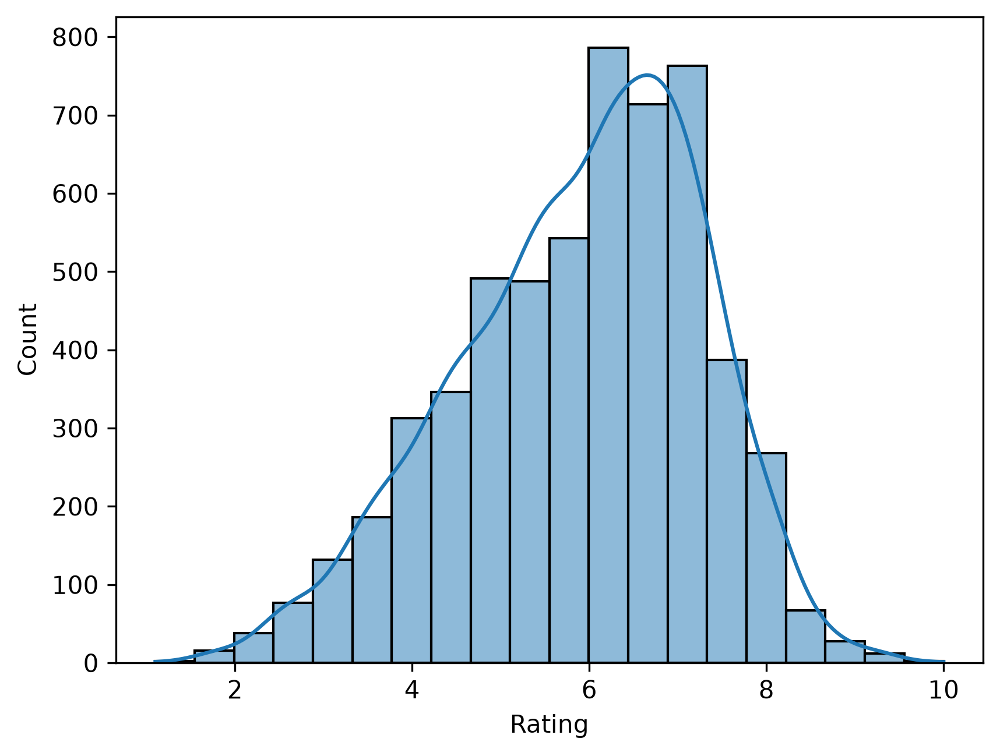
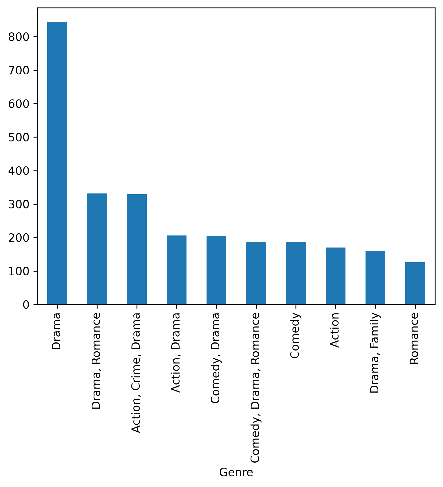
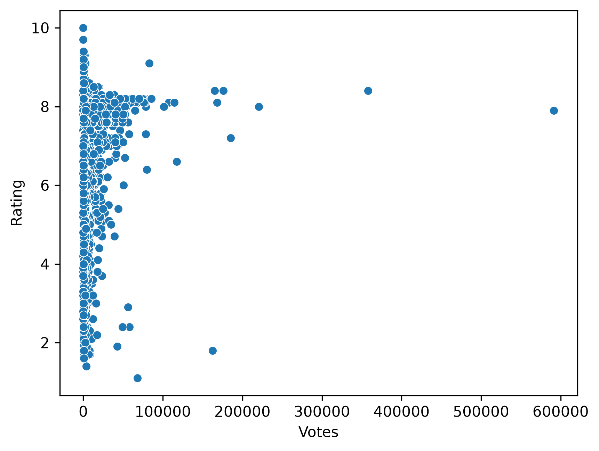

#### **# Movie Rating Prediction with Python**

##### \## Project Overview

This project predicts movie ratings using machine learning based on movie metadata such as Genre, Director, Actors, Year, Duration, and Votes.

##### \## Dataset

\- Name

\- Year

\- Duration

\- Genre

\- Director

\- Actor 1

\- Actor 2

\- Actor 3

\- Votes

\- Rating

##### \## Technologies Used

\- Python

\- Pandas

\- NumPy

\- Matplotlib

\- Seaborn

\- Scikit-learn

##### \## Machine Learning Model

\- Random Forest Regressor

##### \## Evaluation Metrics

\- MAE

\- RMSE

\- R² Score

##### \## Results

MAE: 0.81

RMSE: 1.10

R² Score: 0.34

##### \## Future Improvements

\- Hyperparameter tuning

\- XGBoost

\- Better feature engineering

## Exploratory Data Analysis

### Rating Distribution

### Top Genres

### Votes vs Rating

